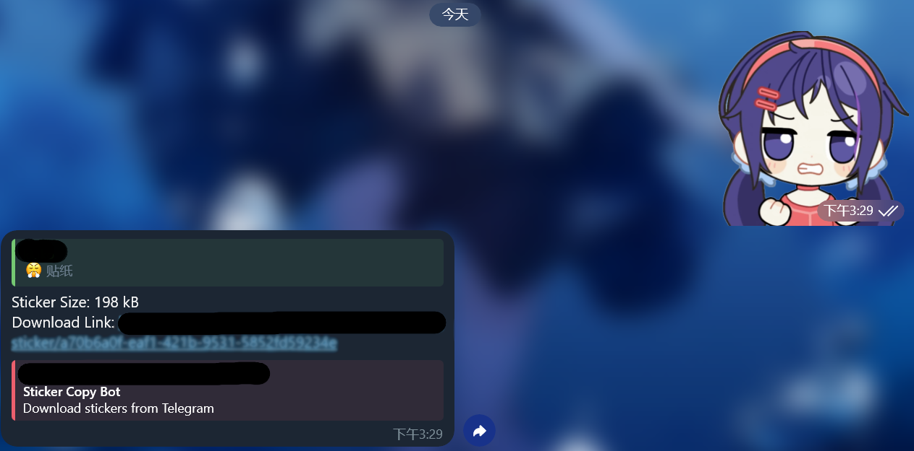

# Sticker Copy Bot

A Serverless Telegram bot to download stickers via browser.

## Features

- Download stickers directly through your browser
- Support for animated stickers
- Free deployment on Cloudflare Workers
- Lightweight and fast response time

## Usage

- Send private messages to the bot with stickers you want to download
- Group mention support (requires disabling bot private mode in BotFather)
- Simply send any sticker to get a download link instantly

## Deploy

1. Fork or clone this repository
2. New Cloudflare Workers
3. Add `BOT_TOKEN` environment variable (obtain from BotFather)
4. Create D1 database and bind to your worker
5. Create KV namespace and bind to your worker
6. Deploy to Cloudflare Workers
7. Open `https://your-bot-username.workers.dev/setup` to initialize the webhook

## Requirements

- Cloudflare Workers account
- Telegram Bot Token (from BotFather)
- Basic knowledge of Cloudflare Workers deployment

## Troubleshooting

If your bot isn't responding, check:
- Webhook setup is complete
- Environment variables are correctly configured
- Worker logs for any errors
